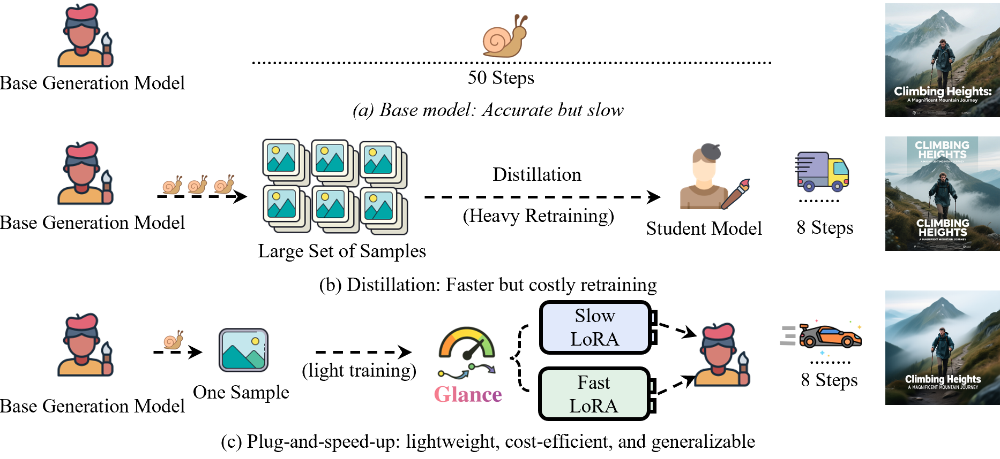

# Glance: One Sample Distillation Model

Official PyTorch implementation of the paper:

**Glance: Accelerating Diffusion Models with 1 Sample**
<br>
[Zhuobai Dong](https://zhuobaidong.github.io/)<sup>1</sup>, 
[Rui Zhao]()<sup>2</sup>,
[Songjie Wu]()<sup>3</sup>,
[Junchao Yi]()<sup>4</sup>,
[Linjie Li]()<sup>5</sup>, 
[Zhengyuan Yang]()<sup>5</sup>, 
[Lijuan Wang]()<sup>5</sup>, 
[Alex Jinpeng Wang]()<sup>3</sup><br>
<sup>1</sup>WuHan University, <sup>2</sup>National University of Singapore, <sup>3</sup>Central South University, <sup>4</sup>University of Electronic Science and Technology of China, <sup>5</sup>Microsoft
<br>
[ArXiv](https://arxiv.org/abs/2510.14974) | [Homepage](https://zhuobaidong.github.io/Glance/) | [Model🤗](https://huggingface.co/CSU-JPG/Glance)



## 🔥News

- [Nov 7, 2025] [ComfyUI-piFlow](https://github.com/Lakonik/ComfyUI-piFlow) is now available! Supports 4-step sampling of Qwen-Image and Flux.1 dev using 8-bit models on a single consumer-grade GPU, powered by [ComfyUI](https://github.com/comfyanonymous/ComfyUI).

**02.09.2025**
- ✅ Added full training for Qwen-Image and Qwen-Image-Edit

## 📦 Installation

1. Create conda environment
   ```bash
   conda create -n glance python=3.10 -y
   conda activate glance
   ```

2. Install required packages:
   ```bash
   pip install -r requirements.txt
   ```

3. Install the latest `diffusers` from GitHub:
   ```bash
   pip install git+https://github.com/huggingface/diffusers
   ```

4. Download pre-trained LoRA weights (optional):
   ```bash
   # Qwen Slow-LoRA weights
   wget https://huggingface.co/CSU-JPG/Glance/blob/main/glance_qwen_slow.safetensors
   
   # Qwen Fast-LoRA weights
   wget https://huggingface.co/CSU-JPG/Glance/blob/main/glance_qwen_fast.safetensors
   ```

---

## 📁 Data Preparation

### Dataset Structure for Qwen-Image and FLUX Training

The training data should follow the same format for both Qwen and FLUX models, where each image has a corresponding text file with the same name:

```
dataset/
├── img1.png
├── img1.txt
```

### Dataset Structure for Qwen-Image-Edit Training

For control-based image editing, the dataset should be organized with separate directories for target images/captions and control images:

```
dataset/
├── images/           # Target images and their captions
│   ├── image_001.jpg
│   ├── image_001.txt
│   ├── image_002.jpg
│   ├── image_002.txt
│   └── ...
└── control/          # Control images
    ├── image_001.jpg
    ├── image_002.jpg
    └── ...
```
### Data Format Requirements

1. **Images**: Support common formats (PNG, JPG, JPEG, WEBP)
2. **Text files**: Plain text files containing image descriptions
3. **File naming**: Each image must have a corresponding text file with the same base name

### Data Preparation Tips

1. **Image Quality**: Use high-resolution images (recommended 1024x1024 or higher)
2. **Description Quality**: Write detailed, accurate descriptions of your images
3. **Consistency**: Maintain consistent style and quality across your dataset
4. **Auto-generate descriptions**: You can generate image descriptions automatically using [Florence-2](https://huggingface.co/spaces/gokaygokay/Florence-2)

### Quick Data Validation

You can verify your data structure using the included validation utility:

```bash
python utils/validate_dataset.py --path path/to/your/dataset
```

This will check that:
- Each image has a corresponding text file
- All files follow the correct naming convention
- Report any missing files or inconsistencies

---

## 🏁 Start Training on < 24gb vram

To begin training with your configuration file (e.g., `train_lora_4090.yaml`), run:

```bash
accelerate launch train_4090.py --config ./train_configs/train_lora_4090.yaml
```


## 🏁 Training

# Qwen Models Training

## Qwen-Image LoRA Training

To begin training with your configuration file (e.g., `train_lora.yaml`), run:

```bash
accelerate launch train.py --config ./train_configs/train_lora.yaml
```

Make sure `train_lora.yaml` is correctly set up with paths to your dataset, model, output directory, and other parameters.

## Inference: Diffusers Pipelines

We provide pipelines for easy inference. The following code demonstrates how to sample images from the distilled Qwen-Image model.

### [Glance (Qwen-Image)](demo/example_gmqwen_pipeline.py)
Note: GM-Qwen supports elastic inference. Feel free to set `num_inference_steps` to any value above 4.
```python
import torch
from diffusers import FlowMatchEulerDiscreteScheduler
from lakonlab.pipelines.piqwen_pipeline import PiQwenImagePipeline

pipe = PiQwenImagePipeline.from_pretrained(
    'Qwen/Qwen-Image',
    torch_dtype=torch.bfloat16)
adapter_name = pipe.load_piflow_adapter(  # you may later call `pipe.set_adapters([adapter_name, ...])` to combine other adapters (e.g., style LoRAs)
    'Lakonik/pi-Qwen-Image',
    subfolder='gmqwen_k8_piid_4step',
    target_module_name='transformer')
pipe.scheduler = FlowMatchEulerDiscreteScheduler.from_config(  # use fixed shift=3.2
    pipe.scheduler.config, shift=3.2, shift_terminal=None, use_dynamic_shifting=False)
pipe = pipe.to('cuda')

out = pipe(
    prompt='Photo of a coffee shop entrance featuring a chalkboard sign reading "π-Qwen Coffee 😊 $2 per cup," with a neon '
           'light beside it displaying "π-通义千问". Next to it hangs a poster showing a beautiful Chinese woman, '
           'and beneath the poster is written "e≈2.71828-18284-59045-23536-02874-71352".',
    width=1920,
    height=1080,
    num_inference_steps=4,
    generator=torch.Generator().manual_seed(42),
).images[0]
out.save('gmqwen_4nfe.png')
```

